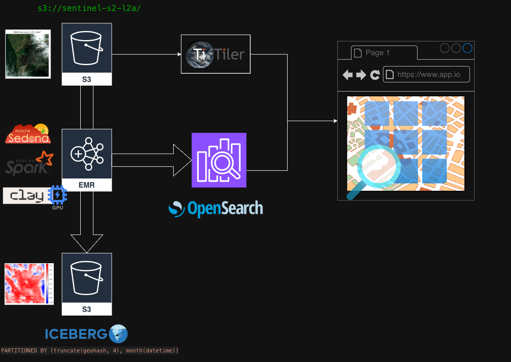
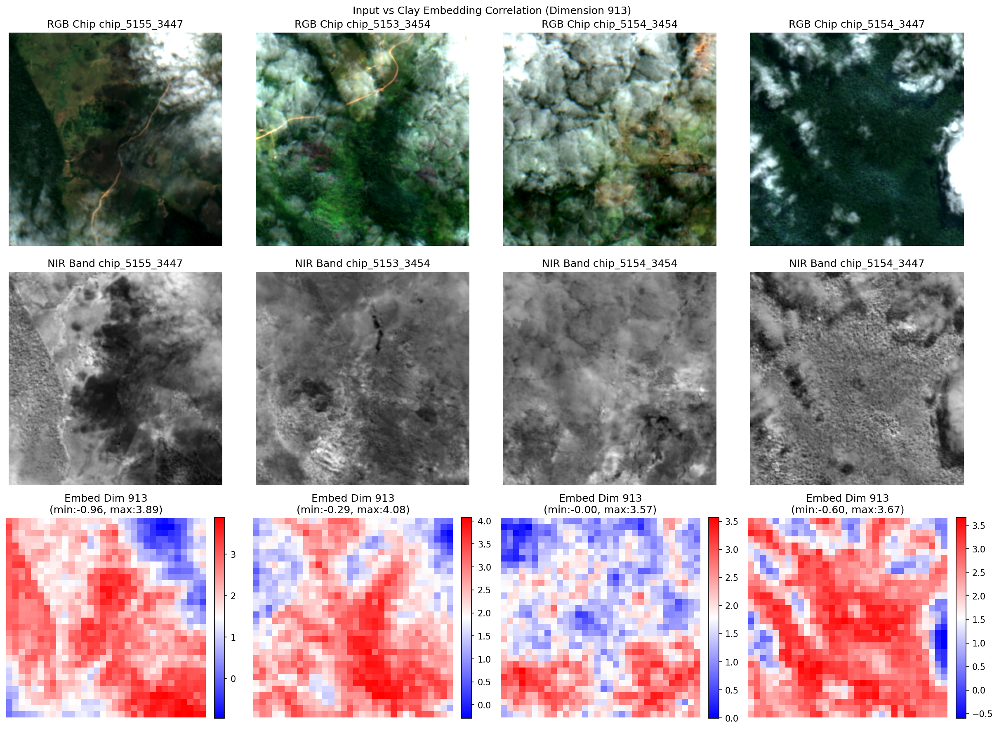
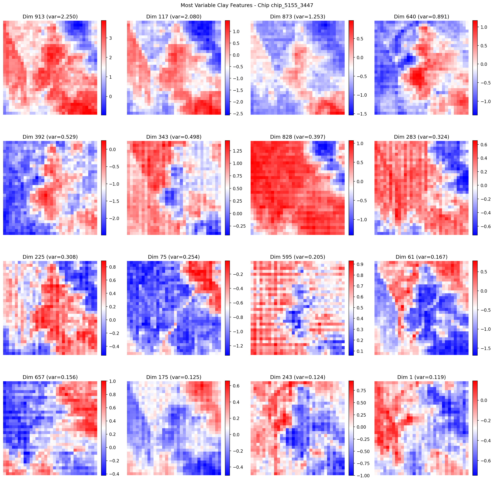

# Sentinel-2 Chip Processing Pipeline with Clay GeoFM

This project creates an AWS infrastructure for processing Sentinel-2 satellite imagery into 256px chips with temporal analysis, Clay GeoFM embeddings, change detection, and vector search using EMR, PySpark, and OpenSearch.

## Architecture

- **EMR Cluster**: GPU-enabled Spark cluster with Apache Sedona for geospatial processing
- **S3 Bucket**: Storage for Iceberg data and processed chips
- **Glue Catalog**: Metadata store for Iceberg tables with geohash partitioning
- **OpenSearch**: Vector database with KNN search for embeddings and geospatial queries
- **Clay GeoFM**: Foundation model for generating embeddings from satellite imagery
- **PySpark Jobs**: Complete pipeline from chip extraction to vector search ingestion



## Development Setup

1. Create virtual environment:
   ```bash
   python3.12 -m venv .venv
   source .venv/bin/activate
   ```

2. Install for development (includes PySpark for local testing):
   ```bash
   # Install dev dependencies (specify architecture: cuda, mps, or cpu)
   ./scripts/install.sh --arch cuda
   ```

## Production Build & Deployment

1. Build distribution assets for deployment:
   ```bash
   ./scripts/build.sh
   ```

   The build process:
   - Builds Python wheel and packaged venv
   - Exports Clay model for target architecture
   - Creates dist/ directory with all deployment assets

2. Deploy infrastructure:
   ```bash
   cdk deploy
   ```

   The deployment process:
   - Uploads venv, wheel, and model to S3
   - Creates EMR cluster with proper dependency management

## Running the Pipeline

### 1. Extract chips from Sentinel-2 imagery:
```bash
uv run python src/sentinel_processing/jobs/chip_extraction.py \
  jobs.chip_extraction.aoi_bounds='[-122.5,-37.8,-122.3,-37.7]' \
  jobs.chip_extraction.start_date=2024-01-01 \
  jobs.chip_extraction.end_date=2024-01-31
```

**Output Table Schema (`chips`):**
| Column | Type | Description |
|--------|------|-------------|
| `id` | string | Unique identifier for each 256px chip |
| `datetime` | timestamp | Acquisition date and time of the imagery |
| `scene_id` | string | Source Sentinel-2 scene identifier |
| `geohash` | string | Geohash for spatial partitioning |
| `scl_mean` | float | SCL band mean for cloud filtering |
| `clay_tensor` | binary | Compressed numpy arrays for Clay model input |
| `geotiff` | binary | GeoTIFF blob for visualization |
| `geometry` | binary | WKB polygon geometry |

### 2. Generate Clay GeoFM embeddings:
```bash
uv run python src/sentinel_processing/jobs/embedding_generation.py \
  jobs.embedding_generation.input_table=chips \
  jobs.embedding_generation.output_table=embeddings
```

**Output Table Schema (`embeddings`):**
| Column | Type | Description |
|--------|------|-------------|
| `id` | string | Links back to source chip |
| `geohash` | string | Geohash for spatial partitioning |
| `datetime` | timestamp | Acquisition date and time of the imagery |
| `embedding` | array<float> | 1024-dimensional Clay GeoFM embedding vector |
| `model_version` | string | Clay model version used for embedding |
| `created_at` | timestamp | Processing timestamp |

### 3. Detect changes between time periods:
```bash
uv run python src/sentinel_processing/jobs/change_detection.py \
  jobs.change_detection.input_table=embeddings \
  jobs.change_detection.output_table=changes
```

**Output Table Schema (`changes`):**
| Column | Type | Description |
|--------|------|-------------|
| `id` | string | Links back to source chip |
| `geohash` | string | Geohash for spatial partitioning |
| `datetime` | timestamp | Acquisition date and time of the imagery |
| `change_score` | float | Cosine distance indicating change magnitude |
| `created_at` | timestamp | Processing timestamp |

### 4. Ingest to OpenSearch for vector search:
```bash
uv run python src/sentinel_processing/jobs/opensearch_ingestion.py
```

Ingests joined data from all three tables into OpenSearch with KNN vector index for similarity search and geospatial queries.

## Clay Foundation Model Results

The pipeline leverages Clay GeoFM (Geospatial Foundation Model) for generating meaningful embeddings from Sentinel-2 imagery:

### Input vs Embedding Visualization


This visualization demonstrates how Clay GeoFM transforms raw Sentinel-2 spectral data into semantically meaningful embeddings. The left panel shows the original satellite imagery, while the right panel displays the learned embedding space where similar land cover types cluster together.

### Top Feature Analysis


Analysis of the most important spectral features learned by the Clay model. This helps understand which wavelengths and band combinations are most discriminative for different land cover classifications, providing insights into the model's decision-making process for geospatial analysis.

## Project Layout

```
sentinel-spark-embedding/
├── docker/
│   └── Dockerfile.build            # Docker build configuration
├── docs/
│   └── images/                     # Architecture diagrams and visualizations
│       ├── architecture_diagram.png
│       ├── input_vs_embedding.png
│       └── top_features.png
├── notebooks/
│   └── pyspark_sedona_rasterio.ipynb # Development notebook
├── scripts/
│   ├── build.sh                    # Build script with dev/production modes
│   └── install.sh                  # Development environment setup
├── src/
│   ├── infra/                      # CDK infrastructure modules
│   │   ├── __init__.py
│   │   ├── stack.py                # Main CDK stack with centralized outputs
│   │   ├── emr.py                  # EMR GPU cluster configuration
│   │   ├── opensearch.py           # OpenSearch cluster for vector search
│   │   ├── permissions.py          # IAM roles and policies
│   │   ├── storage.py              # S3 buckets and Glue catalog
│   │   └── vpc.py                  # VPC and networking configuration
│   └── sentinel_processing/        # Python package for data processing
│       ├── jobs/
│       │   ├── __init__.py
│       │   ├── chip_extraction.py  # Sentinel-2 chip extraction job
│       │   ├── embedding_generation.py # Clay GeoFM embedding job
│       │   ├── change_detection.py # Temporal change detection job
│       │   └── opensearch_ingestion.py # Vector search ingestion job
│       ├── lib/
│       │   ├── __init__.py
│       │   ├── clay_utils.py       # Clay model integration
│       │   ├── emr_utils.py        # EMR job utilities
│       │   ├── raster_utils.py     # Raster processing and chip extraction
│       │   └── sedona_utils.py     # Geospatial processing utilities
│       ├── __init__.py
│       ├── config.py               # Configuration management
│       └── config.yaml             # Default configuration
├── web/
│   └── index.html                  # Simple web interface
├── app.py                          # CDK app entry point
├── cdk.json                        # CDK configuration
├── pyproject.toml                  # Python package configuration
└── README.md
```

## Build Modes

**Development Setup** (`./scripts/install.sh`):
- Downloads Clay model and sets up development environment
- Installs editable package with dev dependencies (includes PySpark)
- Ideal for local development and testing

**Production Build** (`./scripts/build.sh`):
- Creates packaged venv, wheel, and source distribution
- Exports Clay model for target architecture
- Generates complete `dist/` directory for deployment

## Cleanup

```bash
cdk destroy
```
